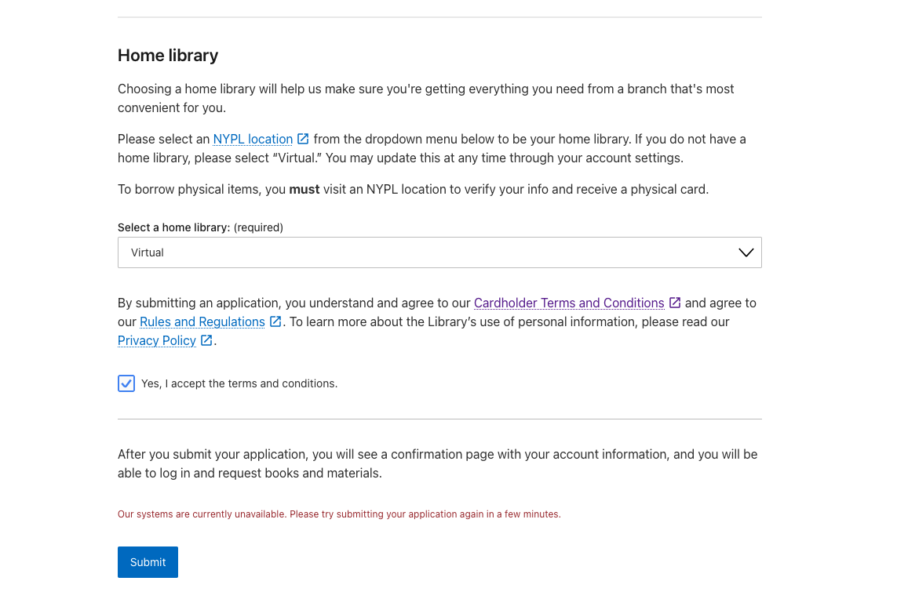

# NYPL Library Card App

A JavaScript Application that allows NYPL patrons to request a library card and create an account. The front-end is
built with React, the back-end uses Node/Express to communicates with other services, via the API gateway which handles
validating & creating a patron record.

## Task : Improve password error messaging

You've received reports that patrons are getting cryptic errors when trying to create new accounts. Through your
conversations, you've determined that the issue can occur when a password is rejected from our patron creator service
(PCS) and/or the Integrated Library System (ILS) we use, Sierra.

Your task is to ensure that patrons have a clear understanding of what went wrong with their application so that they
can correct any mistakes and receive a library card.

## Production Site and Version

The production site on NYPL.org:

- https://www.nypl.org/library-card/new/

## Installation & Configuration

### Node Version Manager (nvm)

Developers can use [nvm](https://github.com/creationix/nvm) if they wish. This repo has a `.nvmrc` file that indicates
which node version we develop against. For more information see [how
`nvm use` works](https://github.com/creationix/nvm#nvmrc).

At the moment, this app is intended to be run on Node v20.x.

### Environment Variables

`.env.local` is committed in this copy. It holds no credentials — only the mock API URLs described below — so the app
runs against the mocks as soon as
the repo is cloned, with nothing to configure. `.env.example` documents the
same set of variables for reference.

Note: Nextjs uses `.env.development` and `.env.production` for their respective platform environment variables. The keys are not encrypted in the repo and are therefore directly added/updated through Terraform. These files are not not necessary to have to run the app locally.

### Install & Running Locally

1. `npm install`
2. `npm run dev` and point browser to http://localhost:3000/library-card/new

### Running locally with mock APIs

`.env.local` points the three API URLs at mock endpoints inside the app
itself, under `pages/api/__mock__/`:

| Variable                | Stands in for                                |
| ----------------------- | -------------------------------------------- |
| `OAUTH_PROVIDER_URL`    | the OAuth provider guarding the Platform API |
| `PATRON_VALIDATION_URL` | address and username validation              |
| `PATRON_CREATION_URL`   | patron creation (the Card Creator endpoint)  |

As you fix the bug, you should feel free to look at this code, but please don't modify it. Assume these would be other
NYPL services that we wouldn't want to modify as part of this fix.
